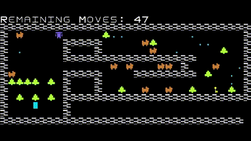
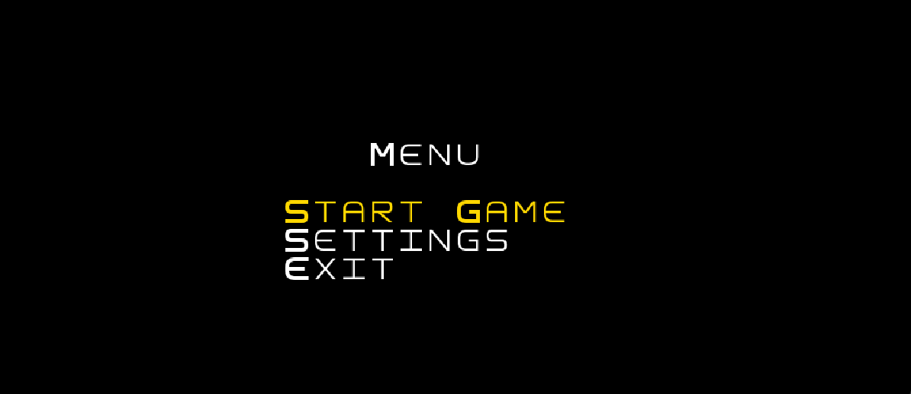
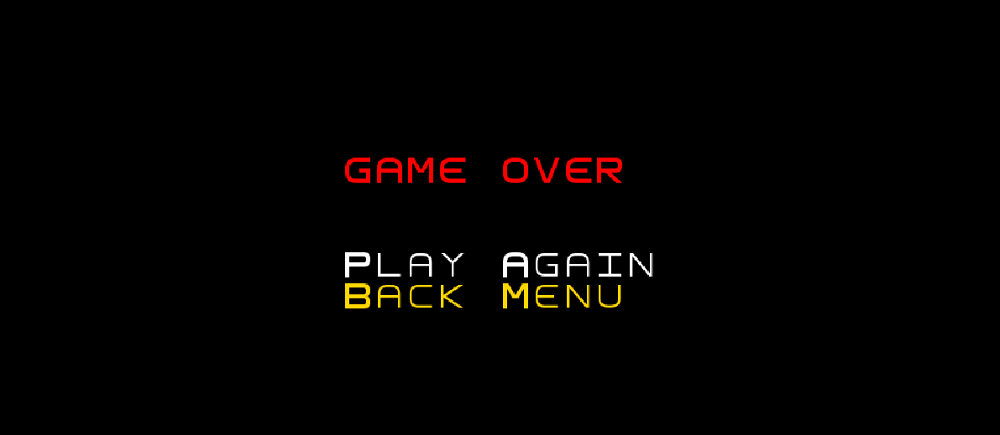
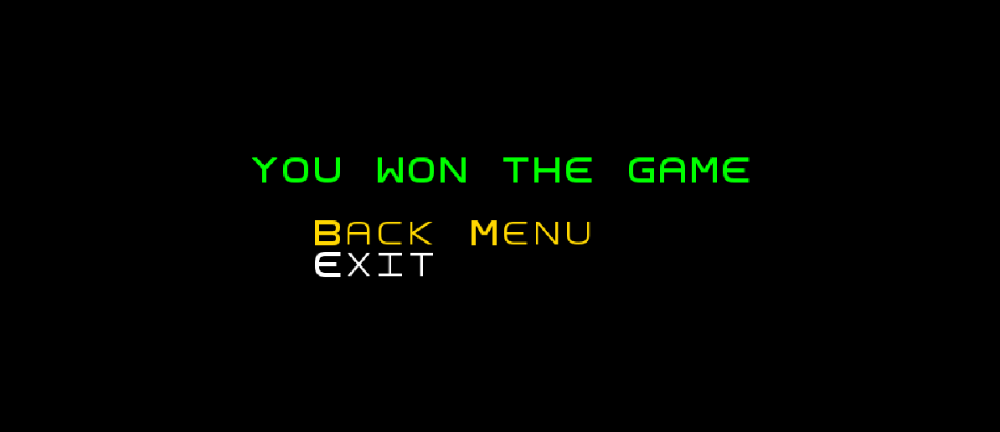
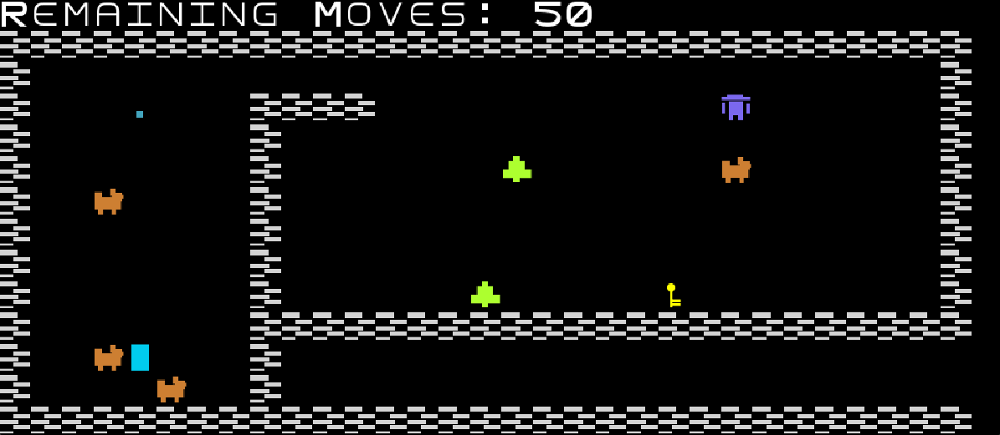
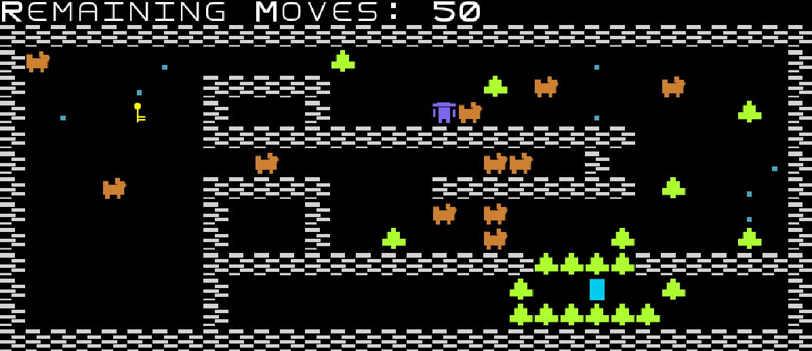

## LDTS_2LEIC08 GR03 - DUSK

Our game is a text-based version of the DUSK '82 game. The main charachter is "The Intruder" whose objective is to open the door, throughout 4 different levels.
For the player to win the game, it needs to achive the key to open the door and then go to the door.
During this path, The Intruder may have attention to the goates and the remaining steps.
To gain steps the main charachter has to collect blue points.

This project was developed by Marta Costa (up202207879@fe.up.pt), Beatriz Sonnemberg (up202206098@fe.up.pt) and Luís Cordeiro (up202205425@fe.up.pt) for LDTS 2023⁄24.

### IMPLEMENTED FEATURES

- **Menu:** When you open the game there will be a menu with some options: Turn on/off the soundeffects and music, select the level and exit the game.
- **The Intruder:** The character will move by pressing the 'w' key to move forward, 'a' to move left, 's' to move backwards, 'd' to move right. By pressing the arrow keys the character will shoot bullets.
- **Bullet:** The Intruder starts the game with a gun, to shoot the goats and trees pressing the arrow keys.
- **Goats:** The characters will be moving randomly, if The Intruder touch the goat, he loses the game.
- **Trees:** On the arena will be trees and for The Intruder to be able to move, he needs to shoot at the trees that block his path in order to eliminate them.
- **Key:** A special item that will be placed in the arena, and it is a request to open the door. The main character need to collect it.
- **Door:** It will be placed in the arena and to complete the level the main charecter needs to open it with a key.
- **Blocks:** It will be placed in the arena and delimits the playing area.
- **Points:** It will be placed in the arena and allows the intruder to gain more movements.
- **Music/Sound Effects:** The music feature and sound effects has been implemented, and it initiates upon pressing the 'Start Game' button. Both can be toggled on or off from the settings menu.

### PLANNED FEATURES

All the planned features have been successfully incorporated.

### SCREENSHOTS

- **Game Preview**

  

  <b><i>Gif 1. Game Preview</i></b>

- **Main Menu:** Through the menu it is possible to start the game, exit the game, choose the level and access the settings.

  

  <b><i>Fig. 1 - Main Menu</i></b>

 
 

  

  <b><i>Fig. 2 - Settings Menu</i></b>

 
 

  

  <b><i>Fig. 3 - Game Over Menu</i></b>

 
 

  

  <b><i>Fig. 4 - Win Menu</i></b>

 
 

- **Levels**

  

  <b><i>Fig. 5 - Level 1</i></b>

 
 

  

  <b><i>Fig. 6 - Level 4</i></b>

 
 

