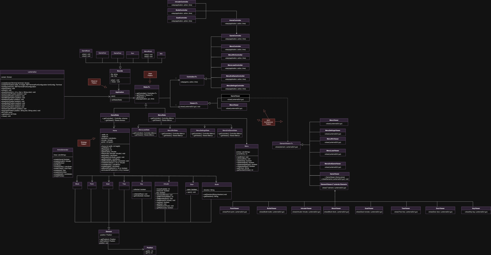
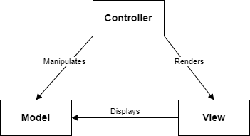
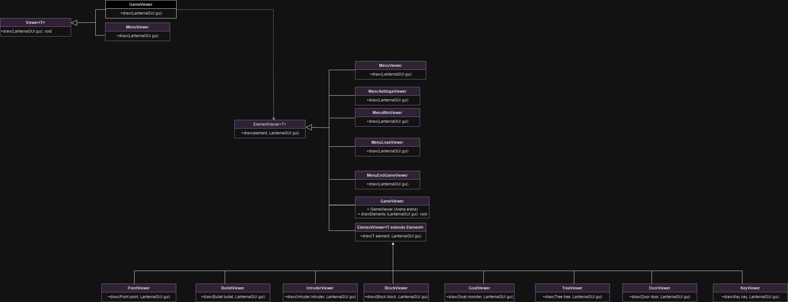
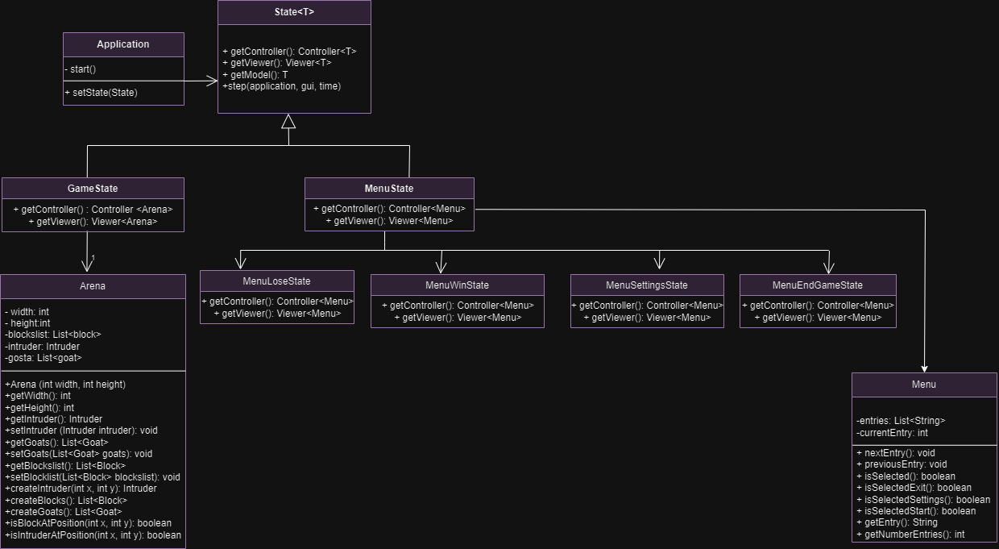
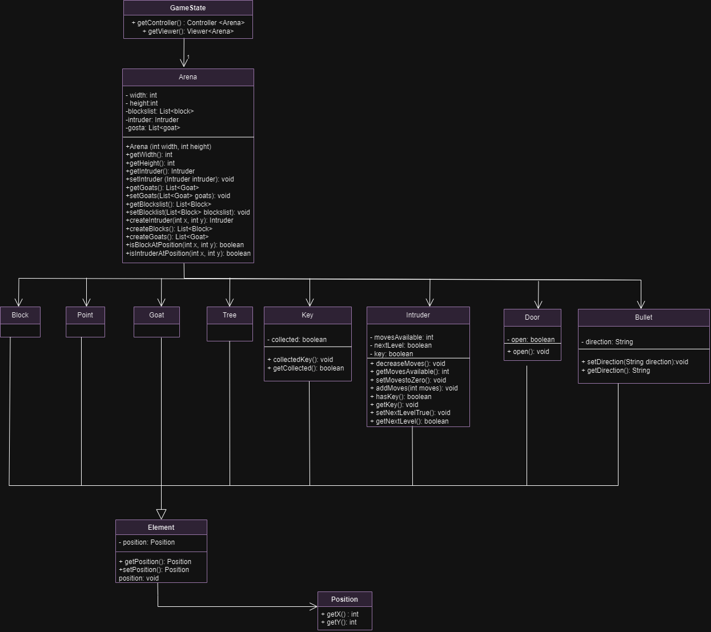
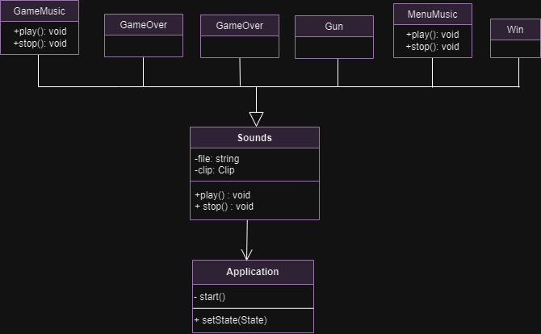
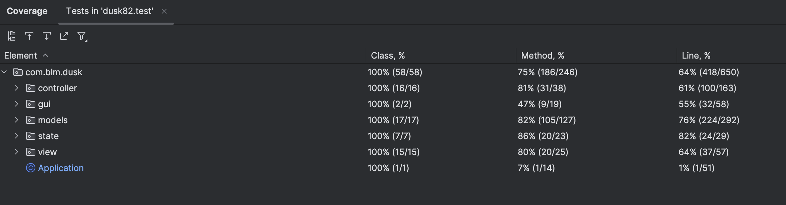
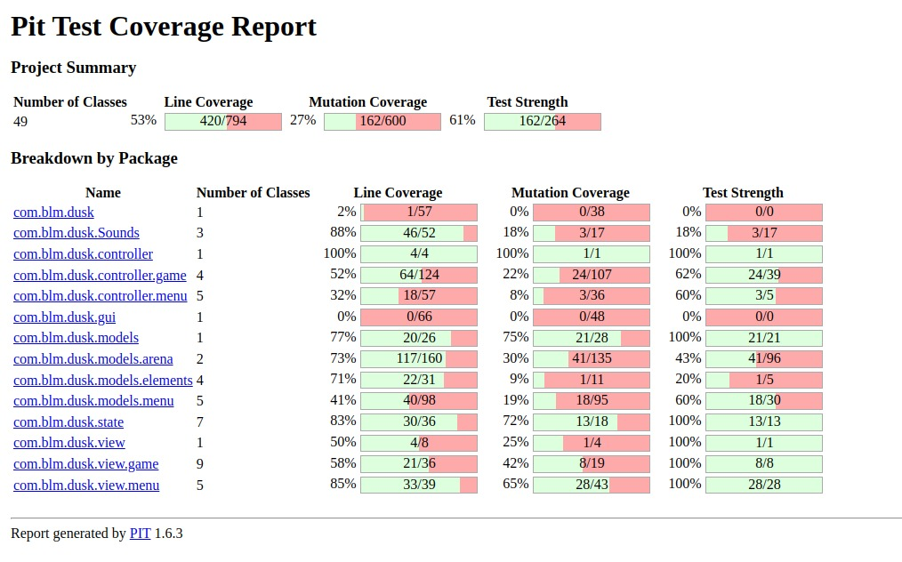

## LDTS_2LEIC08 GR03 - DUSK

Our game is a text-based version of the DUSK '82 game. The main charachter is "The Intruder" whose objective is to open the door, throughout 4 different levels.
For the player to win the game, it needs to achive the key to open the door and then go to the door.
During this path, The Intruder may have attention to the goates and the remaining steps.
To gain steps the main charachter has to collect blue points.

This project was developed by Marta Costa (up202207879@fe.up.pt), Beatriz Sonnemberg (up202206098@fe.up.pt) and Luís Cordeiro (up202205425@fe.up.pt) for LDTS 2023⁄24.

### IMPLEMENTED FEATURES

- **Menu:** When you open the game there will be a menu with some options: Turn on/off the soundeffects and music and exit the game.
- **The Intruder:** The character will move by pressing the 'w' key to move forward, 'a' to move left, 's' to move backwards, 'd' to move right. By pressing the arrow keys the character will shoot bullets.
- **Bullet:** The Intruder starts the game with a gun, to shoot the goats and trees pressing the arrow keys.
- **Goats:** The characters will be moving randomly, if The Intruder touch the goat, he loses the game.
- **Trees:** On the arena will be trees and for The Intruder to be able to move, he needs to shoot at the trees that block his path in order to eliminate them.
- **Key:** A special item that will be placed in the arena, and it is a request to open the door. The main character need to collect it.
- **Door:** It will be placed in the arena and to complete the level the main character needs to open it with a key.
- **Blocks:** It will be placed in the arena and delimits the playing area.
- **Points:** It will be placed in the arena and allows the intruder to gain more movements.
- **Music/Sound Effects:** The music feature and sound effects has been implemented, and it initiates upon pressing the 'Start Game' button. Both can be toggled on or off from the settings menu.

### PLANNED FEATURES

All the planned features have been successfully incorporated.

### DESIGN

**Problem in Context**

To create our game, we needed to find the into architectural patterns that best fit our needs.

  

  <b><i>Fig 1. Model, Controller and Viewer pattern</i></b>

**The Pattern**

We decide to use the Model-View-Controller (MVC) pattern, this pattern divides an application into three parts:

 - The model only represents the data.
 - The view displays the model data, and sends user actions to the controller.
 - The controller provides model data to the view, and interprets user actions.

These classes can be found here:

- [Model](https://github.com/FEUP-LDTS-2023/project-l08gr03/tree/main/src/main/java/com/blm/dusk/models)
- [Controller](https://github.com/FEUP-LDTS-2023/project-l08gr03/tree/main/src/main/java/com/blm/dusk/controller)
- [Viewer](https://github.com/FEUP-LDTS-2023/project-l08gr03/tree/main/src/main/java/com/blm/dusk/view)

**Implementation**
  It increases code reusability, it's easier to debug, update, and maintain the codebase over time.

  

  

  <b><i>Fig 1. Model, Controller and Viewer pattern</i></b>

-----------

**Dynamic Element Rendering**

**Problem in Context**

Rendering elements like Blocks, Intruder, and Goats on the screen dynamically based on their state and position.
The rendering logic for each element varies, and the rendering strategy needs to adapt based on the element.

**The Pattern**

We decide to use the Strategy Pattern.Create rendering strategies for each element type (Block, Intruder, Goat, ...) implementing a common rendering interface.
Utilize a rendering context that holds a reference to the specific rendering strategy based on the element type.

**Implementation**

This implementation provides a flexible rendering mechanism, allowing different elements to be rendered based on their specific rendering strategies.
Simplifies the addition of new elements or changes in rendering logic without affecting the existing code.
  

  

  <b><i>Fig 2. Strategy pattern</i></b>

-----

**Intruder Behavior Complexity**

**Problem in Context**

The Intruder's movement behavior is intricately tied to multiple factors such as obstacles, collectibles, and arena conditions.
The Intruder's movement logic is entangled with conditional checks based on various factors, leading to code complexity.

**The Pattern**

We decide to use the State Pattern. Define different states (Normal, ObstacleInteraction, CollectibleInteraction) representing distinct movement behaviors of the Intruder.
Implement a class that holds a reference to the current state and delegates movement behavior based on the active state.

 **Implementation**
 
This implementation simplifies Intruder behavior management by isolating each behavior in separate state classes.
Enhances maintainability, as adding or modifying states doesn't impact other parts of the code.
  

  

  <b><i>Fig 3. State Pattern</i></b>

---

**Dynamic Arena Element Behavior**

**Problem in Context**

The behavior of arena elements changes based on real-time interactions (e.g., Intruder movement, Goat movement).
 Elements within the arena need to react to changes initiated by other elements without tight coupling.

 **The Pattern**
 
 We decide to use the Observer Pattern. Observers & Subjects: Define arena elements as observers subscribing to events of interest (e.g., Intruder movement, Goat position change).
Notification System: Implement a notification mechanism where when an event occurs, observers are notified, triggering their specific reactions.

 **Implementation**
 
 This implementation enables a loosely coupled interaction between elements, allowing changes in one element to trigger responses in others without direct dependencies.
Facilitates scalability by allowing new elements to subscribe to events easily.
Each of these design patterns was instrumental in addressing specific challenges within the Dusk82 project, enhancing code organization, maintainability, and flexibility in managing arena elements and their behaviors.

  

  

  <b><i>Fig 4. Observer Pattern</i></b>

-----

**Sound Effects**

**Problem in Context**

When introducing sound effects, the challenge arose of determining when and how to activate them.

**The Pattern**

We decide to use the Observer Pattern. This is because alterations in the Application object affect other objects, necessitating sound effects to be notified when a state change occurs.

**Implementation**

This implementation ensures that whenever the state changes, the sound objects are notified to play the sound corresponding to the new state.

  

  

  <b><i>Fig 5. Sound Effects</i></b>

## Known-code smells

We were able to identified same errors from the error-prone and fixed all of them. 

## Testing

### Screenshot of coverage report

class coverage: 100%, method coverage: 75%, line coverage 64%

  

  <b><i>Fig 6. Code Coverage</i></b>

### Screenshot of mutation Test-Pit

  

  <b><i>Fig 6. Code Coverage</i></b>

### SELF-EVALUATION

Beatriz Sonnemberg- 33,3%

Marta Costa- 33,3%

Luís Cordeiro- 33,3%

